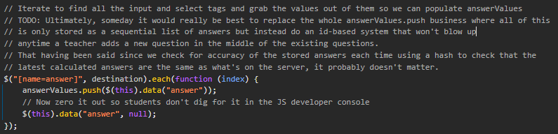

# Positive Physics Solver
**If you looked this up, *shame*.**

# ❗ Usage ❗
Extension: Tampermonkey.

Paste the **script.js** in a new script tab and go to a <u>***new problem***</u>.

# TROUBLESHOOTING

TL;DR: Only works on <u>***new problems***</u>.
 - Extra Practice: Finalize, restart.
 - Work: No clue. I don't think you can reset, so just start the script before entry.
 - Assesment: ¯\\\_(ツ)_/¯

### side note
They have a whole essay in their code to get rid of this. 
There's another repo for positive physics hack from 2019 made by some guy who made a bookmarklet. 
I just thought it was interesting no one made a positive physics hack in such a long time.
*(I found some other comments, and I think this was in the todo since 2019? aka same year the other guy had his stuff patched)*

